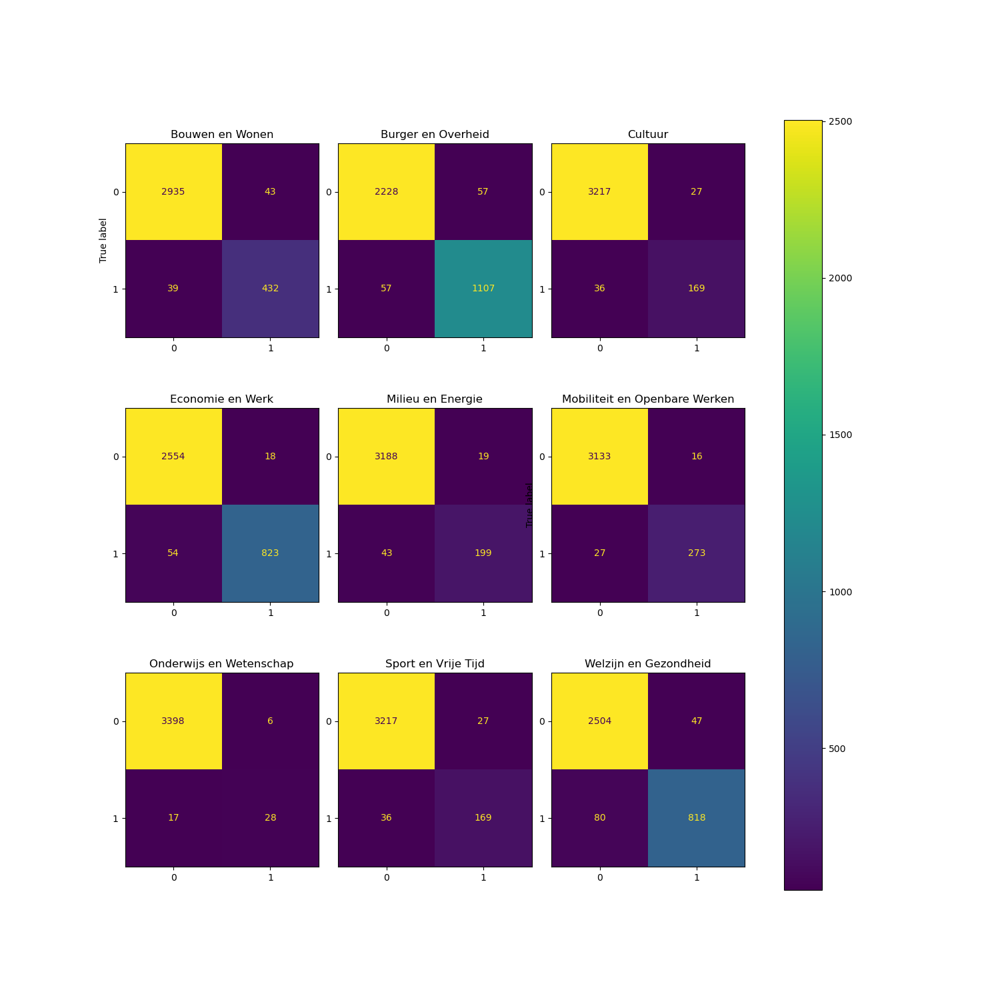
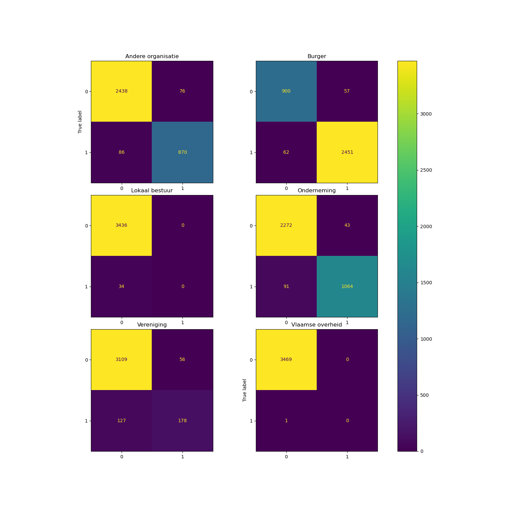

# General approach
When discussing what use of AI was possible on the business case of the hackathon, we immediatly found that two approaches were possible to build a solution which benefits the ecosystem and provides value for ABB.

One of them consisted of improving the search functionality. Recently, retriavel augmentation and generation systems (RAG) have become very popular in this area as they combine the power of any form of search technology with the power of LLMs to create anwers to general user queries. As such we first investigated this as a use case to provide search on IPDC.

However, we quickly found that IPDC currently has about 22k records, and applying the filters quickly brings down the number of entries a lot. Provided with 2 or 3 short entries using an LLM to formulate an answer seems like overkill. For the current IPDC, the existing application looks very good for querying. 

It is mentioned in the use-case description that adding entries is a cumbersome task, reprocessing a decision into a new format. To this end, we believe AI can excel and can generate most value. Group 8 designed a solution to grab a decision, extract its content and then use several AI tools to start prepopulating an IPDC entry. We used LLMs to interpret the text of a decision and generate descriptions, but we also used classifiers for tasks where they excel. 

# Large language models (LLM)

As a first step, a prompt is used to extract free form text from the decision. This is mainly used to generate description, extract costs, procedures and conditions. 

## Mistral-Nemo & More complex data structure prompts

Our first attempt involved using Mistral Nemo with complex data structure prompts. This approach provided decent results but also presented several challenges.

1. Invalid JSON responses happened
1. Responses were sometimes mixed between Dutch and English
1. The content sometimes strayed from the intended purpose, with hallucinations and inconsistencies
1. Fully open-source model and relatively fast response time

We wanted to use Mistral Nemo because it is: fully open source (Apache 2.0 License), trained by a European organisation and somewhat efficient to run on a CPU compared to a larger model. Due to the undesirable outputs, we decided that we would at least need to try a different model as well.

## Transition to Llama 3.1 (70b)

We tested Llama 3.1 (70b), which yielded significantly better results but still had drawbacks.

1. The content was more aligned with the input text.
1. While accuracy improved overall, it wasn’t perfect but still a notable step forward
1. Response time increased immensely, up to 3 minutes per field
1. Utilizing examples in the prompts didn't help as Llama took info directly out of these examples even when context was adjusted
1. Non-European model with a slightly more restrictive license, however this would only be an issue with more than 700 million active users per month

## Simplified approach with single fields

We shifted to a more simplified prompting approach, using a single field that encapsulated each property. This provided some improvements.

1. Consistency improved across responses
1. Response time decreased due to having only one prompt which extracts all information at once

Utilizing both the stronger Llama model and the adjusted prompting approach allowed for better general performance for the extracted information. It's a shame we couldn't use examples within the prompts but we needed to make a decision due to the high latency to prompt the model which reduced actual testing time.

Due to the use of Llama 3.1, with a more restrictive license (can still be used for commercial purposes as long as number of active users is less than 700 million per month).

## Final prompt
Our group has developed several iterations of a prompt or chain thereof. In the end, the following prompt was used:
```
EXTRACTION_PROMPT = f'''You are an expert in extracting information from unstructured text into a JSON instance.
Specifically, you have expert knowledge of so-called decisions (in Dutch: 'besluit' or 'besluiten'), which are decisions made by a government (can be on different levels: municipality, province, etc.) on a Public Service.
You will extract the requested information from a provided decision under [> Decision (unstructured text):].
Since you are fluent in Dutch, you will extract the information in Dutch from a decision document written in Dutch.
This information will be made visible to citizens, agents and companies through the products and services catalog (IPDC).
Therefore, it is important to provide sufficient context such that those stakeholders can understand.
Do not invent or extrapolate any information; only use exact text from the provided decision.

> Decision (unstructured text):
>>>
{{{TEXT_KEY}}}
>>>

{{{FORMAT_INSTRUCTIONS_KEY}}}

Reminder that the values of all fields within the JSON instance need to be written in Dutch and need to contain only information coming from the decision provided above. Make sure your output is complete: all relevant information from the decision provided above must be extracted.'''
```

With FORMAT_INSTRUCTIONS_KEY:
```python
# simplified approach
class IPDCInformationToExtract(BaseModel):
    '''Information to extract from the provided decision for a publicly available products and services catalog. All field values are written in Dutch and contain only information coming from the provided decision.'''
    title: str = Field(description=TITLE)
    description: str = Field(description=DESCRIPTION)
    procedures: str = Field(description=PROCEDURES)
    costs: str = Field(description=COSTS)
    conditions: str = Field(description=CONDITIONS)
```

and following field descriptions:
```
TITLE = 'The official Name of the Public Service. It is used as a title in the web application.'
DESCRIPTION = '''A text description of the Public Service that potential users of the Public Service can see in any public service catalogue.
You are encouraged to include a reasonable level of detail in the description, for instance including basic eligibility requirements for the particular Public Service and contact information.'''
PROCEDURES = '''A detailed outline of each of the procedures in citizen readable language (do not refer to articles). Contains the specific rules, guidelines or procedures that need to be followed.
It can include the terms of service, licence, and authentication requirements of the Public Service. If multiple procedures are applicable for the Public Service, make sure to include all of them.'''
COSTS = '''A detailed outline of the costs related to the execution or utilization of the Public Service that the user of that Public Service needs to pay. If multiple costs are applicable for the Public Service, make sure to include all of them.'''
CONDITIONS = '''A detailed outline of the requirements of the Public Service. A requirement can specify the expected value that the requirement response has to contain, or a range of threshold values which the requirement response has to fit within. 
A requirement may apply to a certain period of time. It can also provide a list of candidate evidences that the responder can use to prove the requirement. If multiple requirements are applicable for the Public Service, make sure to include all of them.'''
```
Apart from consuming even more computational time, we found no benefit from using a prompt chain.

## Final thoughts
In general, open source LLM options currently available can be used to extract and generate text in the ecosystem of ABB. Smaller models exist, but usually tend to suffer from a lack of consistency (they can excell and produce great output, but the probability it will be moderate is higher). 

Bigger options exist, of which we tested LLama 3.1 70B. Usually, the issues seen with the smaller models somewhat automatically disappear or become much less frequent. Different options such as Mixtral 8x22B are also available but due to the limited time during the hackaton we didn't proceed this route further. Furthermore we did not explore LLama 3.2 which was very recently released which may also be a great option. 

# Classifiers
For data extraction which presented itself as classification tasks, we chose classic classification through a transformer instead of LLMs. Due to their non-deterministic and free-text response, setting up a validation experiment for classifiers is simpler and, today, better stability can be achieved through them. Last but not least, resource requirements are significantly lower to evaluate classifiers instead of LLMs. 

To this end, we parsed the CSV of the IDPC catalog, and extract description, theme, type and doelgroep. We trained a multilabel classification algorithm for theme, type and doelgroep using the description as an input. 

The transformer we fine tuned was papluca/xlm-roberta-base-language-detection on huggingface, a multilingual transformer for text classification supporting dutch. A 20% test split was used, with f1 score, precision and recall being recorded for each label. 

Known limitations:
* We don't pull data from the SparQL endpoint of IDPC yet, this should be added for compliance with the ecosystem guidelines.
* If we don't have a label for an entry, we skip it from the training data. We should also allow for no-label scenarios (or atleast verify). However, it remains uncertain if no-label in IDPC means there is no label or it wasn't entered. 
* There is no model repository
* Data validation has been basic, there has been no thorough check for data leakage (however, the two poor scoring classes for doelgroep seem to suggest there is no severe data leakage)
* We accidentaly split Cultuur, Sport en Vrije Tijd in two classes
* We trained on the descriptions in IPDC, not the descriptions generated by LLM

## Thema
                               precision    recall  f1-score   support

              Bouwen en Wonen       0.91      0.92      0.91       471
           Burger en Overheid       0.95      0.95      0.95      1164
                      Cultuur       0.86      0.82      0.84       205
             Economie en Werk       0.98      0.94      0.96       877
            Milieu en Energie       0.91      0.82      0.87       242
    Mobiliteit en Openbare Werken   0.94      0.91      0.93       300
      Onderwijs en Wetenschap       0.82      0.62      0.71        45
          Sport en Vrije Tijd       0.86      0.82      0.84       205
        Welzijn en Gezondheid       0.95      0.91      0.93       898

                    micro avg       0.94      0.91      0.93      4407
                    macro avg       0.91      0.86      0.88      4407
                 weighted avg       0.94      0.91      0.92      4407
                  samples avg       0.93      0.93      0.92      4407


## Type
                            precision    recall  f1-score   support

      Advies en begeleiding       0.84      0.87      0.85       223
                     Bewijs       0.99      0.97      0.98      1159
        Financieel voordeel       0.91      0.94      0.93       572
    Financiele verplichting       0.95      0.83      0.88        92
    Infrastructuur en materiaal   0.79      0.64      0.71        98
                  Toelating       0.98      0.96      0.97      1197
                   Voorwerp       0.69      0.59      0.64        70

                  micro avg       0.95      0.93      0.94      3411
                  macro avg       0.88      0.83      0.85      3411
               weighted avg       0.95      0.93      0.94      3411
                samples avg       0.93      0.93      0.93      3411
                


## Doelgroep
                    precision    recall  f1-score   support

    Andere organisatie   0.92      0.91      0.91       956
            Burger       0.98      0.98      0.98      2513
    Lokaal bestuur       0.00      0.00      0.00        34
       Onderneming       0.96      0.92      0.94      1155
        Vereniging       0.76      0.58      0.66       305
      Vlaamse overheid   0.00      0.00      0.00         1

         micro avg       0.95      0.92      0.94      4964
         macro avg       0.60      0.57      0.58      4964
      weighted avg       0.94      0.92      0.93      4964
       samples avg       0.96      0.95      0.95      4964
       


## RLHF
When the training template would be linked to the actual IPDC SparQL endpoint, a new training run would incorporate all corrections by humans achieving RLHF.

## Classifier template
We created a [docker template](https://github.com/lblod/classifier-template-smart-ipdc-generator-group-8) to create a FastAPI webservice for these classifiers with only a dockerfile and no single line of code. It is a further extension of mu-python-ml. This results in immutable docker containers that can be deployed in the microservice architecture.
