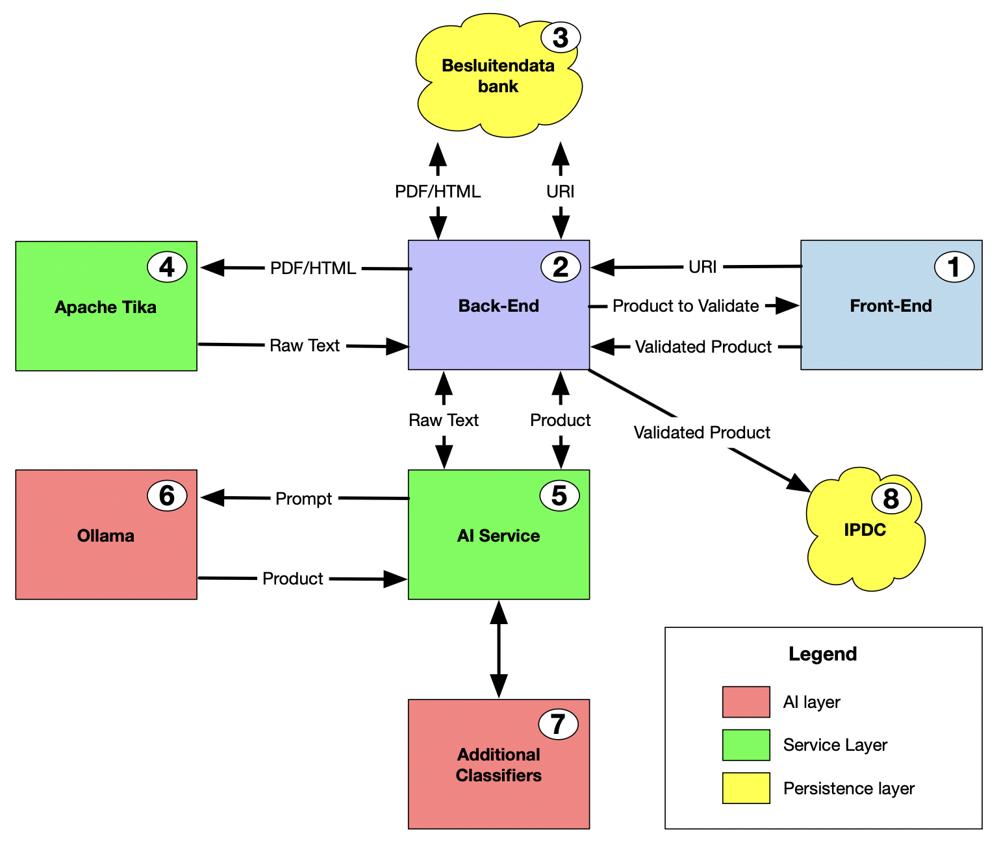

# Architecture

## Introduction

This document provides a high-level overview of the architecture of the solution developed by Team 8 for the ABB Hackathon.

We describe a document processing pipeline designed to automate the extraction, analysis, and validation of document data using a combination of machine learning and manual oversight.

The primary goal of this architecture is to streamline the document processing workflow by automating text extraction and classification, while incorporating human oversight to validate the generated data. The AI components handle the bulk of content interpretation, supported by additional classifiers to ensure accuracy.

## Architecture

### Overview

### Front-end

The front-end is a minimal web-based interface designed for administrative users to interact with the system efficiently.

Users are able to submit a URI referencing a specific document within the Besluitendatabank. Once the back-end completes the data processing pipeline for the submitted URI, the generated data is presented to the user for validation. At this stage, the user can either approve or reject the generated information.

The front-end is developed using Ember.js, a widely adopted, open-source JavaScript framework.

The front-end source code is available at https://github.com/lblod/frontend-smart-ipdc-generator-group-8.

### Back-end

The back-end is responsible for managing the document processing pipeline. It orchestrates the various components of the system, ensuring that the document data is extracted, classified, and validated correctly.

The first step of the pipeline is downloading the document from the Besluitendatabank. The document is then passed to the text extraction service, which extracts the relevant text data. The extracted text is then passed to the AI-driven product generation service, which generates a product based on the extracted text. The product is then passed to the AI service, which classifies the product. The classified product is then presented to the user for validation.

The back-end is developed using python, a widely adopted, open-source programming language.

The back-end source code can be found at https://github.com/lblod/backend-smart-ipdc-generator-group-8.

### Document Repository

The document repository contains _Besluiten_, which are used as input for the system. The repository is accessed by the back-end to download the document for processing.

### Text Extraction Service

The text extraction service is responsible for retrieving relevant text data from the document, which is then forwarded to the back-end for further processing.

This service utilizes Apache Tika, a widely adopted open-source library, to efficiently extract text from various document formats.

The configuration of the Tika service can be found in the docker configuration found at https://github.com/lblod/app-smart-ipdc-generator-group-8.

### AI-driven Classification and Product Generation

This particular part of the architecture is responsible for generating products based on the extracted text data. The generated products are then classified using an AI model to ensure accuracy. It uses the AI Service to run the LLM models and a custom AI model to classify the generated products.

### AI Service

The Ollama service, a widely used open-source platform for large language models (LLMs), is utilized to run LLM models within the system. The platform provides a REST API, enabling seamless integration with other services, enhancing interoperability and flexibility within the architecture.

The configuration of the Ollama service can be found in the docker configuration found at https://github.com/lblod/app-smart-ipdc-generator-group-8.

### Custom AI Model

A custom AI model was developed using data exported from the file `producten_en_diensten_2024-09-13_21-47-37.csv`. This model aids in classifying the generated products. Due to the constraints of the hackathon, the model was trained on a small dataset and a limited number of fields, which currently restricts its accuracy. However, with additional training data and further optimization, the model’s performance can be significantly enhanced.

More information can be found in following repositories:

- https://github.com/lblod/ai-training-smart-ipdc-generator-group-8
- https://github.com/lblod/classifier-template-smart-ipdc-generator-group-8
- https://github.com/lblod/type-classifier-ipdc-generator-group-8
- https://github.com/lblod/doelgroep-classifier-ipdc-generator-group-8

### Export Functionality

A potential future enhancement is the addition of an export feature, enabling users to export the validated generated data to the IPDC platform. This would streamline data integration and improve workflow efficiency.
